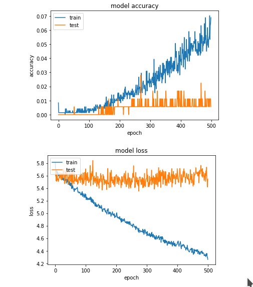
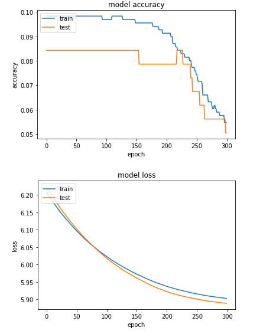
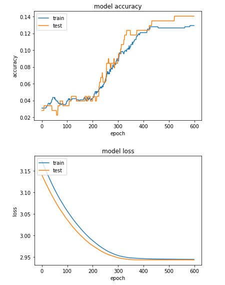
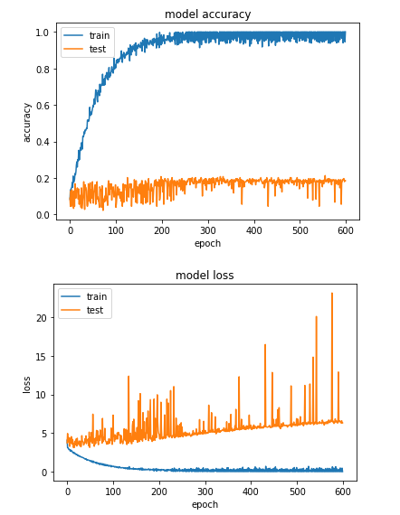
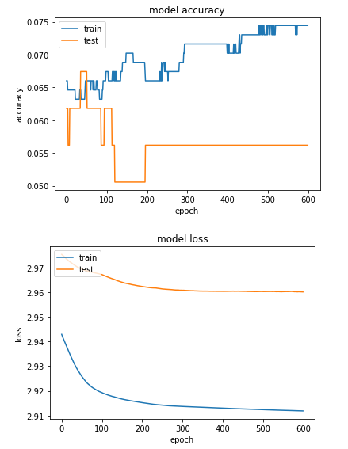
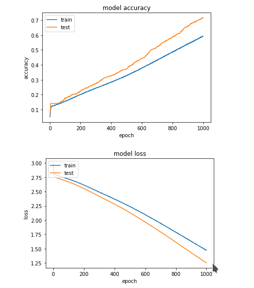

# Dectection de type pokemon

## Présentation du projet

L'objectif de ce projet est la mise en place d'une IA permettant la reconnaissance du type d'un pokemon à partir d'une image.
Pour ce faire, nous avons dû créer un ensemble de données pour permettre l'entrainement des modèles.
À la suite de cela, nous devrons entrainer des modèles à partir de ces données.
Pour finir, ces modèles devront être exposés par une API Web.

## Création du dataset

Pour la création du jeu de données, nous avons utilisé les images sur un wiki pokemon.
Celui-ci recense tous les pokemons de toutes les générations avec leurs types.
Nous avons formaté les données à l'aide de scripts python, le résultat de ce formatage est un ensemble d'images standardisé sous une dimension, un format spécifique le PNG et d'un CSV avec les types associés aux images.

## Exploitation du dataset

Certaines questions liées à l'exploitation des données se sont montrées.

- La transparence des images n'est pas utile nous pouvons donc la retirer.
- Les labels présents dans le CSV sont des chaines des caractères, pour les exploiter il faut donc faire un dictionnaire de valeurs numérique.
- Bien que l'analyse se base sur les types de pokemon, le fait d' avoir qu'une image de chaque pokemon ne risque-t-il pas de poser problème ?

## Analyse de l'entrainement des modèles

- ### Modèle perceptron

Nous avons commencé par la création d'un modèle avec une seule couche.
Le nombre de valeurs de sortie étant de 19, la couche devra donc posséder ce même nombre de neurones.
Voici le dictionnaire utilisé pour convertir les labels en valeur numérique.

```py
pokemon_types_number_dic = {
    'Bug' : 0,
    'Dark' : 1,
    'Dragon' : 2,
    'Electric' : 3,
    'Fairy' : 4,
    'Fighting' : 5,
    'Fire' : 6,
    'Flying' : 7,
    'Ghost' : 8,
    'Grass' : 9,
    'Ground' : 10,
    'Ice' : 11,
    'Normal' : 12,
    'Poison' : 13,
    'Psychic' : 14,
    'Rock' : 15,
    'Steel' : 16,
    'Water' : 17,
    18 : 18
}
```

Par l'intermédiaire d'un changement de la valeur du **learning_rate** dans l'optimiseur. Il s'agit du **rythme** auquel le modèle apprend à chaque itération.
Nous utilisons un optimiseur **rmsprop** pour éviter une explosion du gradient.
Le second paramètre sur lequel nous avons agi est le nombre **d'epochs**. Il s'agit du nombre de passages sur le modèle des données.
Pour l'analyse, on utilise une couche **Dense** avec une **méthode d'activation softmax**.
La couche **Dense** sort un nombre de sorties égal à son nombre de neurones.
L'utilisation de **softmax** est motivée par la valeur qu'il retourne, il retourne une valeur entre 0 et 1 pour chaque classe (label) de notre couche. Avec notre couche de **19 neurones** softmax retourne une valeur pour chaque label.
Pour être plus juste, en multipliant par 100 on peut avoir un pourcentage ce qui est facile à analyser pour un humain.  



Comme on peut le voir en plus de ne pas avoir de bon résultat en entrainement, en test nous n'arrivons pas à faire reconnaitre les données de test au modèle.
De plus à chaque lancement les valeurs sont aléatoires.

Observation perceptron

L'entrainement de ce modèle a mis en évidence plusieurs problèmes.

- Malgré les modifications sur l'optimiseur et sur le nombre d'epochs, les résultats en plus d'être peut probant seront aléatoire à chaque passage.

- En premier, un modèle avec une seule couche n'est pas assez complexe pour permettre d'observer des similitudes de façon efficace au sein des données d'entrainement.

- En second, le faible nombre d'images dans le jeu données pose un gros problème. Avoir que **890 images** et avoir **qu'une image de chaque pokemon** rend le jeu de données difficilement généralisable. Avoir qu'une image de chaque pokemon pose un problème, le jeu de données d'entrainement et de test sont presque sans liens. Et le faible nombre de données diminue de nombre d'information que le modèle peut extraire.

- ### Modèle perceptron multicouche

À partir du précédent modèle, nous avons ajouté des couches supplémentaires pour complexifier le modèle.
Les couches ajoutées sont toujours des **Dense**, mais avec une activation **ReLU**.
Le choix d' une activation **ReLU** qui est assez standard est motivé par la volonté d'éviter la saturation du gradient. Pour faire simple, c'est pour éviter que le modèle tire des conclusions trop vite.



Malheureusement comment on peut le constater, les résultats ne sont pas ceux attendus. Les données mettent en évidence que le jeu de données est peu fiable.

Pour simplifier le problème, nous avons décidé de retirer la détection de 2 types d'un pokemon en faveur de la détection d'un seul type.



Les résultats sont meilleurs après la simplification du problème, toutefois la précision est toujours à la hauteur de nos attentes.

Les aléas des phases de test

Durant les modifications des différents paramètres, des problèmes sont apparus. Ces exemples ci-dessous sont des effectués avec l'entrainement avec un type à détecter.

Le surentrainement:



Le surentrainement est visible sur le graphique ci-dessus.
On le voit grâce à la **précision de 100% en entrainement** et à **l'augmentation de la loss** pour les données de test.
Pour faire simple, le modèle est tellement calibré sur les données d'entrainement qu'il a perdu toute capacité de généralisation.

Le manque d'entrainement:



Le manque d'entrainement est visible sur le graphique ci-dessus.
On peut constater que la précision en est à un niveau assez bas.
On constate aussi que les courbes de **train loss** et **test loss** qui ne s'approche jamais.

Observation perceptron multicouche

Nous avons dans ce second modèle pu confirmer que le jeu de données va et nous pose problème. La complexité du modèle n'est toujours pas assez complexe.
Une simplification du problème pour juste détecter 1 type, mais pas deux a été effectuée.

- ### Modèle CNN

Pour le problème des données nous avons pris le risque de dupliquer les données quitte à ce que certaines données d'entrainement soient dans les données de test.
La raison du choix du CNN est liée au contexte de son utilisation. Le CNN est un modèle d'apprentissage multicouche précisément utilisé pour l'analyse des images.
Ce modèle nous permet de récupérer plus d'information venant des images du jeu de données.
Le CNN est un modèle perceptron multicouche qui utilise la convolution.
La convolution consiste en l'utilisation de filtre sur l'image pour permettre d'altérer ladite image.
Ces altérations sont utiles au modèle pour extraire des données.



Comment nous pouvons le constater les résultats sont bien meilleurs pour ce modèle.

Observation CNN

Le CNN résout beaucoup de problèmes vus précédemment. Il est toutefois bon de noter que, la présence de données d'entrainement dans le jeu de données de test expose des résultats potentiellement biaisés.

## Conclusion et retour d'expérience

Pour conclure, on peut dire que dans l'ensemble l'état du jeu de données nous a posé des problèmes jusqu'à la fin.
Que ce soit par son manque de diversité ou de quantité, tenter d'entrainer un modèle avec ces données était une mauvaise idée.
Il est extrêmement complexe de déterminer quel algorithme utiliser dans quel cas.
Le traitement de l'image implique un certain nombre de connaissances sur le sujet.

Dans l'ensemble, ce projet nous a beaucoup apporté malgré toujours quelques points obscurs.
